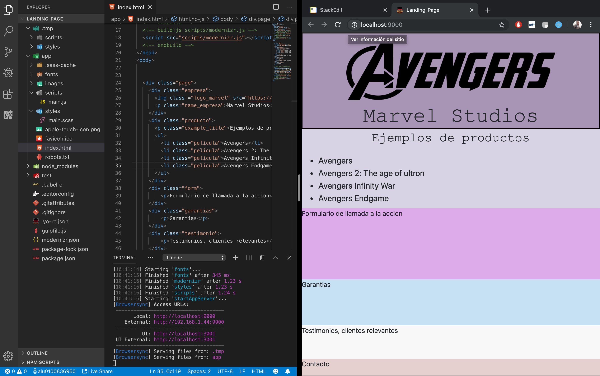

# Práctica 1: Configuración del WorkSpace  
### Alberto Martín Núñez

## Objetivo de esta práctica
El objetivo de esta primera práctica es configurar  nuestra maquina en donde vamos a realizar las distintas prácticas instalando los principales paquetes que vamos a utilizar. 
## Índice
1. [Instalación de paquetes](#i1)
2. [Despliegue de un proyecto de prueba](#i2)
3. [Resumen de las herramientas instaladas](#i3)

## 1. Instalación de paquetes  

### yoman
Vamos a utilizar **yoman**, una herramienta que nos permite crear estructuras de carpetas y ficheros de manera automática sin necesidad de perder tiempo cada vez que queramos iniciar un nuevo proyecto.
Para utilizar **yoman** tenemos que instalar primeramente **npm** que es el gestor de paquetes de node. Para ello utilizamos, en mi caso, `brew install npm`.
Ahora ya podemos ejecutar `npm install -g yo` para instalar **yoman**.
**Yoman** utiliza un generador de proyectos que hay que instalar, para esta primera práctica haremos uso de un generador que crea una estructura compleja ya definida(_webapp_). Para instalarla usaremos: `npm install -g generator-webapp`

### git
Como sistema de control de versiones utilizaremos **git**. Para instalarlo ejecutamos, en mi caso, `brew install git`.
Podemos aplicarle una serie de configuraciones como el nombre de usuario o el correo del mismo usando `git --config`. Para ver la configuración existente podemos usar `git config --list`.

### gestor de dependencias
- **npm** ---> Gestor de dependencias de node 
	Ejecutaríamos `npm init` y se crearía el fichero *package.json*
- **bower** ---> Gestor de dependencias en el lado de cliente
	Para usar bower primero tenemos que instalarlo con `npm install bower` y posteriormente hacer un `bower init`, con esto crearíamos el archivo *bower.json*.

### gulp
**Gulp** es una herramienta de automatización de forma que vigila en tiempo real los archivos que queramos de nuestro proyecto y en base a eso ejecuta ciertas tareas que le indiquemos cada vez que esos archivos sufren algún cambio.
 Estas tareas se programan en un archivo llamado *gulpfile.js*.

Para instalar **gulp** usaremos `npm install --global gulp-cli`y lo agregaremos al proyecto usando `npm install gulp --save-dev``.

### browser-sync
**Browsersync** permite lanzar navegadores para verifiar los cambios que se ejecuten en el proyecto en tiempo real.
Para instalarlo ejecutamos `npm install -g browser-sync`
Para ejecutarlo utilizamos `browser-sync start --server`.
En nuestro caso como usamos **gulp**, ejecutaremos otro comando para ver en tiempo real los cambios en el navegador ejecutando `npm gulp serve`.

### gulp-minify-css
Podemos usar **gulp** para minificar archivos como *.css* y eliminar caracteres suplerfuos y conseguir un archivo de menor tamaño. 
Para ello tenemos que instalarlo y añadirlo al proeycto con `npm install --save-dev gulp-minify-css`.
Posteriormente habría que incluir la *tarea* al archivo gulpfile.js si no se ha añadido automaticamente.

### sourcesmaps
Con este paquete podremos observar los ficheros minificados en el navegador tal y como fueron creados originalmente.
Para ellos tenemos que isntalarlo y añadirlo al proyecto ejecutando `npm install --save-dev gulp-sourcesmaps.
Posteriormente habría que incluir la *tarea* al archivo gulpfile.js si no se ha añadido automaticamente.

## 2. Despliegue de un proyecto de prueba  
Para desplegar nuestro proyecto de ejemplo vamos a utilizar **yoman**  que nos creará una estructura ya definida e instalada, *webapp*, (paso que hemos realizado en el primer punto). 
Ejecutamos `yo webapp` y se nos creará una estructura como la siguiente(*marcada en rojo*):

Para visualizar los cambios que vamos realizando en la pagina utilizaremos **gulp**, instalado en el primer paso. Como podemos ver en el fichero *package.json*, en el ámbito *scripts* ya existe un script que se crea automaticamente que se llama **start**.

 Por lo tanto, para que se nos abra un navegador con la página para poder ir visualizando los cambios en tiempo real tendremos que ejecutar el comando `npm start`. 
 
 En este caso se visualizara un ejemplo de una MockUp Landing Page:

## 3. Resumen de las herramientas instaladas  

